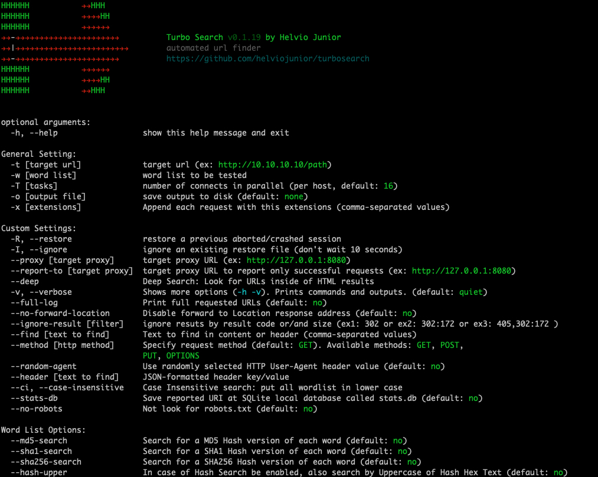

# TurboSearch #

[](https://turbosearch.readthedocs.io/en/latest/) [](https://github.com/helviojunior/turbosearch) 

`TurboSearch` An python application to look for URL based on word list.. 



This application supports multi-threading requests.

## Installation

You can install the latest version of TurboSearch by using the GitHub repository:


```
pip3 install git+https://github.com/helviojunior/turbosearch.git#egg=turbosearch
```


Or uou can download the latest version of TurboSearch by cloning the GitHub repository:

```
git clone https://github.com/helviojunior/turbosearch/
```

If you would like to run TurboSearch from anywhere in your system you can install it with pip3:


```
cd turbosearch
pip3 install .
ou
python3 -m pip install .
```


To uninstall it:


```
pip3 uninstall turbosearch -y
ou
python3 -m pip uninstall turbosearch -y
```


## General informations

When you no use **-x** paramter this tool will search url based on wordlist, but without extensions.
Usinig **-x** paramter, the tool will do standard search (without extension) + extented search with extensions, so i strongly recommend to you **-x** paramters in all utilizations


# Utilization samples/exemplos de utilização
```
./turbosearch.py -t http://10.10.10.10/ -w /usr/share/dirb/wordlists/big.txt
./turbosearch.py -t http://10.10.10.10/ -w /usr/share/dirb/wordlists/big.txt -x .html,.xml,.php,.txt
./turbosearch.py -t http://10.10.10.10/ -w /usr/share/dirb/wordlists/big.txt -x .html,.xml,.php,.txt -o /path/to/output/file.txt

```


```

HHHHHH           →→HHH
HHHHHH           →→→→HH
HHHHHH           →→→→→→
→→-→→→→→→→→→→→→→→→→→→→→→→          Turbo Search v0.1.15 by Helvio Junior
→→|→→→→→→→→→→→→→→→→→→→→→→→→        automated url finder
→→-→→→→→→→→→→→→→→→→→→→→→→          https://github.com/helviojunior/turbosearch
HHHHHH           →→→→→→
HHHHHH           →→→→HH
HHHHHH           →→HHH


optional arguments:
  -h, --help                  show this help message and exit

General Setting:
  -t [target url]             target url (ex: http://10.10.10.10/path)
  -w [word list]              word list to be tested
  -T [tasks]                  number of connects in parallel (per host, default: 16)
  -o [output file]            save output to disk (default: none)
  -x [extensions]             Append each request with this extensions (comma-separated values)

Custom Settings:
  -R, --restore               restore a previous aborted/crashed session
  -I, --ignore                ignore an existing restore file (don't wait 10 seconds)
  --proxy [target proxy]      target proxy URL (ex: http://127.0.0.1:8080)
  --report-to [target proxy]  target proxy URL to report only successful requests (ex: http://127.0.0.1:8080)
  --deep                      Deep Search: Look for URLs inside of HTML results
  -v, --verbose               Shows more options (-h -v). Prints commands and outputs. (default: quiet)
  --full-log                  Print full requested URLs (default: no)
  --no-forward-location       Disable forward to Location response address (default: no)
  --ignore-result [filter]    ignore resuts by result code or/and size (ex1: 302 or ex2: 302:172 or ex3: 405,302:172 )
  --find [text to find]       Text to find in content or header (comma-separated values)
  --method [http method]      Specify request method (default: GET). Available methods: GET, POST,
                              PUT, OPTIONS
  --random-agent              Use randomly selected HTTP User-Agent header value (default: no)
  --header [text to find]     JSON-formatted header key/value
  --ci, --case-insensitive    Case Insensitive search: put all wordlist in lower case
  --stats-db                  Save reported URI at SQLite local database called stats.db (default: no)
  --no-robots                 Not look for robots.txt (default: no)

Word List Options:
  --md5-search                Search for a MD5 Hash version of each word (default: no)
  --sha1-search               Search for a SHA1 Hash version of each word (default: no)
  --sha256-search             Search for a SHA256 Hash version of each word (default: no)
  --hash-upper                In case of Hash Search be enabled, also search by Uppercase of Hash Hex Text (default: no)


```
